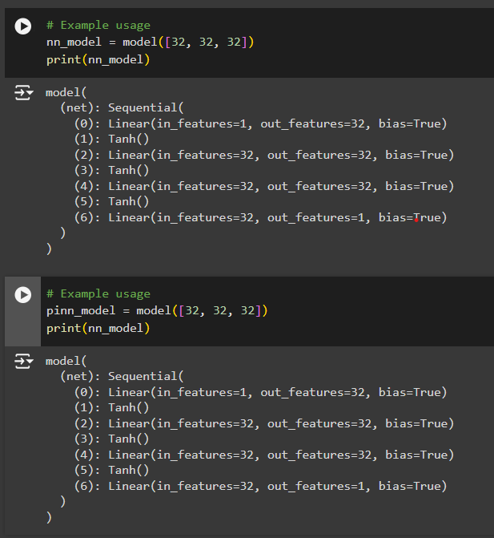
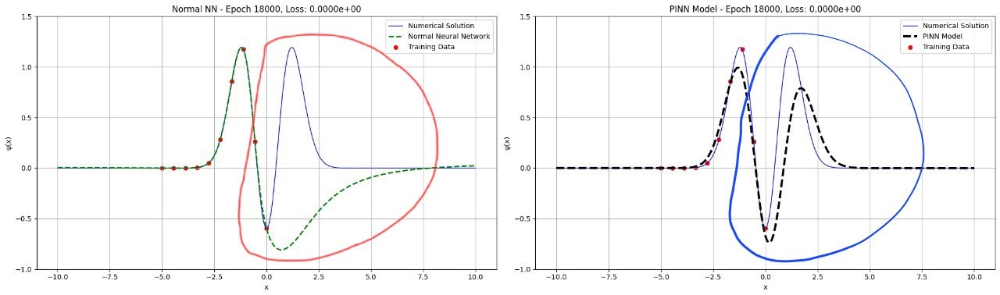
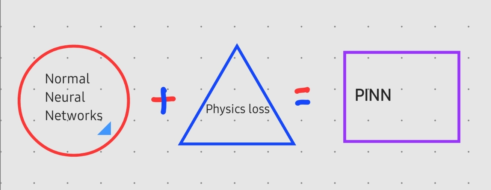

# PINN for Quantum Harmonic Oscillator

By <a href="//commons.wikimedia.org/wiki/User:AllenMcC." title="User:AllenMcC.">AllenMcC.</a> - <a href="//commons.wikimedia.org/w/index.php?title=File:HarmOsziFunktionen.jpg&amp;action=edit&amp;redlink=1" class="new" title="File:HarmOsziFunktionen.jpg (page does not exist)">File:HarmOsziFunktionen.jpg</a>, <a href="https://creativecommons.org/licenses/by-sa/3.0" title="Creative Commons Attribution-Share Alike 3.0">CC BY-SA 3.0</a>, <a href="https://commons.wikimedia.org/w/index.php?curid=11623546">Link</a>

## The Struggle of Normal Neural Network is REAL, however Physics Informed Neural Network(PINN) behaves really well.

## Mathematics

For a Quantum Harmonic Oscillator, we need to solve the Schrödinger equation:

### Hamiltonian:
$$ H = \frac{p^2}{2m} + \frac{1}{2} m \omega^2 x^2 $$

The Schrödinger equation becomes:

$$ \left( \frac{-\hbar^2}{2m} \frac{d^2}{dx^2} + \frac{1}{2} m \omega^2 x^2 \right) \psi(x) = E \psi(x) $$

Where \( \omega = \frac{k}{m} \).

We know the energy for a Quantum Harmonic Oscillator will be quantized:

$$ E = \left(n+ \frac{1}{2}\right) \hbar \omega $$

The solution for the wavefunction is:

$$ \psi(x) = \left(\frac {m \omega} {\pi \hbar}\right)^\frac{1}{4} \frac{1}{\sqrt{2^n n!}} H_{n}\left(\frac{\sqrt{m \omega}}{\hbar} x\right) \exp\left(-\frac{m \omega x^2}{2\hbar}\right) $$

## Physics Loss

Since we have the governing Partial Differential Equation (PDE), we can calculate the physics loss. The definition of the physics loss is:

$$ \left( \frac{-\hbar^2}{2m} \frac{d^2}{dx^2} + \frac{1}{2} m \omega^2 x^2 \right) \psi(x) - E \psi(x) = \text{PDE Loss} $$

## Boundary Loss

We also need to define the boundary loss. Since the wavefunction should be zero at the boundaries, we incorporate this condition into our total loss function.

## What's the Change?

In Normal Neural Networks (NNNs), we don't typically incorporate these kinds of losses; only data loss is used. However, with Physics-Informed Neural Networks (PINNs), we can describe the underlying physical system. A model that uses physics loss in addition to data loss is expected to perform better than a model that learns solely from data.

The advantage of PINNs becomes evident when we have data from a certain phenomenon that we want to predict. Even with limited data, PINNs can make better predictions by leveraging physical knowledge. This is especially useful for spatio-temporal data, medical applications like MRI scans, etc.

## Workflow
## Model

The total loss is a combination of the data loss and the physics loss:

### Total Loss

Total Loss = Data Loss + Physics Loss

Where:

$$L_{physics} = \frac{1}{M} \sum_{i=1}^{M} \left( -\frac{\hbar^2}{2m} \frac{d^2 \psi(x_i)}{dx^2} + V(x_i) \psi(x_i) - E \psi(x_i) \right)^2$$

$$L_{data} = \frac{1}{N} \sum_{i=1}^{N} \left( \hat{y}(x_i) - y(x_i) \right)^2$$

### Total Loss = $\lambda L_{physics} + \mu L_{data}$

where $\lambda$ and $\mu$ are the weights for different losses.

### Create Train Data and Test Data

In my problem, I give chunks of data from the left-hand side of the wavefunction to train the model, and the rest of the wavefunction will be for the model to predict. By observing the curve fitting, we can understand how the model behaves for different wavefunctions in the case of the quantum harmonic oscillator.

### Plots

#### Normal Neural Network on the LHS and Physics Informed Neural Network (PINN) on the right learning for quantum harmonic oscillator state n=2

#### Normal Neural Network on the LHS and Physics Informed Neural Network (PINN) on the right learning for quantum harmonic oscillator state n=3

#### Normal Neural Network on the LHS and Physics Informed Neural Network (PINN) on the right learning for quantum harmonic oscillator state n=8

## Differences of Normal Neural Network (NNN) and Physics Informed Neural Network (PINN)

The Struggle of Normal Neural Network is REAL, however Physics Informed Neural Network (PINN) behaves really well.

### Don't Get it? Look Down (A simple Picture)

### Want to Learn More:

- [YouTube Playlist](https://www.youtube.com/playlist?list=PLMrJAkhIeNNQ0BaKuBKY43k4xMo6NSbBa)
- [Jousef LITE Channel](https://www.youtube.com/@JousefLITE)
- [GitHub Repository](https://github.com/benmoseley/harmonic-oscillator-pinn)

